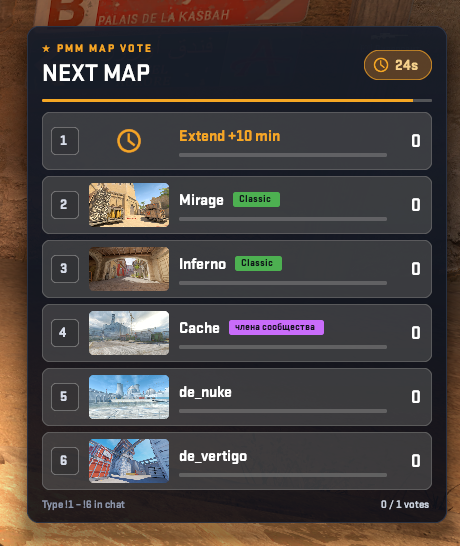
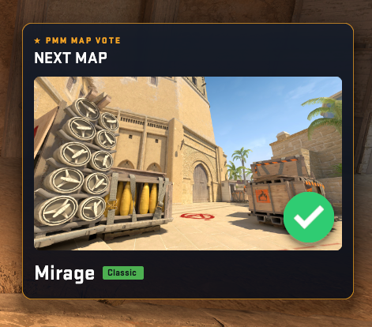

# PMM_GG1MapChooser

<h2><a href="https://genesis-cs.space/menuconstructor/index.html">>>>Более подробная информация на сайте<<<</a></h2>




Bridge by **Rimmer** between [GG1MapChooser](https://github.com/ssypchenko/GG1MapChooser) 1.8.1 and [PanoramaMenuManager](https://github.com/RRimmer/PanoramaMenuManagerCS2) (MenuManagerCS2 1.2.03). GG1MapChooser is not changed: Harmony patches its WASD menu classes at runtime.

Current version: **0.0.2**. Needs CounterStrikeSharp 1.0.376 (.NET 10), GG1MapChooser 1.8.1 and MenuManager 1.2.03.

- Every GG1 WASD menu (nominate, admin maps, yes/no vote) opens in MenuManager.
- The end-of-map vote is its own panorama panel: map picture, name, badge, vote bar, counter, "your vote", timer and "N / M votes".
  `Panorama` mode votes by mouse click, `Chat` mode by `!1 … !N` (Surf, KZ). Position left, center or right.
  The result is a tick on the winning row or a next-map card.
- The round in which GG1 starts the vote gets a longer `mp_freezetime`. The old value comes back after the vote.

## Repository layout

| Folder | What it is |
| --- | --- |
| `PMM_GG1MapChooser` | The plugin: `Plugin.cs` (Harmony, GG1 → MenuManager), `MapVote.cs` (vote panel), `Freeze.cs` (freeze time), `MapsCss.cs` (map pictures CSS), `Config.cs` |
| `PMM_GG1MapChooser/panorama` | Client files for the MultiAddonManager addon: `pmm_mapvote.xml`, `pmm_mapvote.css`, `pmm_mapvote_maps.css` |
| `PMM_GG1MapChooser/lib` | `0Harmony.dll` (Lib.Harmony 2.4.2, net10.0) |
| `MenuManagerApi` | Compile-time library. Do not copy `MenuManagerApi.dll` next to this plugin |
| `configs` | Example config |

## Install from a Release

Copy `Server-plugins/counterstrikesharp` into `game/csgo/addons/`. You get:

- `plugins/PMM_GG1MapChooser/PMM_GG1MapChooser.dll`
- `plugins/PMM_GG1MapChooser/harmony/0Harmony.dll`
- `configs/plugins/PMM_GG1MapChooser/PMM_GG1MapChooser.json`

`0Harmony.dll` stays only in `harmony/`. A copy next to the plugin DLL breaks the patches ("Resolving to a collectible assembly is not supported"). Restart the server after an install or update: `css_plugins reload` does not unload Harmony.

In the GG1 config set `EndMapVoteMenuMode`, `NominationsMenuMode` and `PoolVoteSettings.MenuMode` to `"Wasd"`. For the freeze time keep `TriggerRoundsBeforeEndVoteAtRoundStart: true` and `TriggerVoteAtRoundStartSecondsFromStart: 0`.

Copy `Content-addonmanager/panorama` into the MultiAddonManager addon and rebuild it in Workshop Tools.

Official maps use the CS2 screenshots. For other maps put a PNG into `panorama/images/custom_game/maps/` in the addon and set `"Image": "maps/name.png"` in `Maps`. The plugin writes `pmm_mapvote_maps.css` next to its DLL (`css_pmm_gg1 css`); copy it into the addon and rebuild.

Server console: `css_pmm_gg1` (status), `css_pmm_gg1 repatch`, `css_pmm_gg1 css`.

## Build

You need the .NET 10 SDK.

```bash
dotnet build PMM_GG1MapChooser.sln --configuration Release
```

Output: `PMM_GG1MapChooser/bin/Release/net10.0/`. Ship `PMM_GG1MapChooser.dll` and `harmony/0Harmony.dll`. Do not ship `CounterStrikeSharp.API.dll` or `MenuManagerApi.dll`.

The changelog is in [CHANGELOG.md](CHANGELOG.md).

## License

[GNU GPL v3](LICENSE).

---

# PMM_GG1MapChooser

<h2><a href="https://genesis-cs.space/menuconstructor/index.html">>>>Более подробная информация на сайте<<<</a></h2>

Мост от **Rimmer** между [GG1MapChooser](https://github.com/ssypchenko/GG1MapChooser) 1.8.1 и [PanoramaMenuManager](https://github.com/RRimmer/PanoramaMenuManagerCS2) (MenuManagerCS2 1.2.03). GG1MapChooser не меняется: Harmony патчит его WASD-меню в рантайме.

Текущая версия: **0.0.2**. Нужен CounterStrikeSharp 1.0.376 (.NET 10), GG1MapChooser 1.8.1 и MenuManager 1.2.03.

- Любое WASD-меню GG1 (номинация, админ-карты, голосование да/нет) открывается в MenuManager.
- Голосование в конце карты — отдельная панорамная панель: картинка карты, название, бейдж, полоса голосов, счётчик, «твой голос», таймер и «N / M голосов».
  Режим `Panorama` голосует кликом мыши, режим `Chat` — через `!1 … !N` (Surf, KZ). Позиция слева, по центру или справа.
  Результат — галочка на победившей строке или карточка следующей карты.
- Раунд, в котором GG1 запускает голосование, получает увеличенный `mp_freezetime`. Старое значение возвращается после голосования.

## Что лежит в репозитории

| Папка | Зачем |
| --- | --- |
| `PMM_GG1MapChooser` | Плагин: `Plugin.cs` (Harmony, GG1 → MenuManager), `MapVote.cs` (панель голосования), `Freeze.cs` (freeze time), `MapsCss.cs` (CSS картинок карт), `Config.cs` |
| `PMM_GG1MapChooser/panorama` | Клиентские файлы для аддона MultiAddonManager: `pmm_mapvote.xml`, `pmm_mapvote.css`, `pmm_mapvote_maps.css` |
| `PMM_GG1MapChooser/lib` | `0Harmony.dll` (Lib.Harmony 2.4.2, net10.0) |
| `MenuManagerApi` | Библиотека только для сборки. `MenuManagerApi.dll` рядом с этим плагином не клади |
| `configs` | Пример конфига |

## Установка с Release

`Server-plugins/counterstrikesharp` копируется в `game/csgo/addons/`. Получится:

- `plugins/PMM_GG1MapChooser/PMM_GG1MapChooser.dll`
- `plugins/PMM_GG1MapChooser/harmony/0Harmony.dll`
- `configs/plugins/PMM_GG1MapChooser/PMM_GG1MapChooser.json`

`0Harmony.dll` лежит только в `harmony/`. Копия рядом с DLL плагина ломает патчи («Resolving to a collectible assembly is not supported»). После установки или обновления полностью перезапусти сервер: `css_plugins reload` не выгружает Harmony.

В конфиге GG1 поставь `EndMapVoteMenuMode`, `NominationsMenuMode` и `PoolVoteSettings.MenuMode` в `"Wasd"`. Для freeze time оставь `TriggerRoundsBeforeEndVoteAtRoundStart: true` и `TriggerVoteAtRoundStartSecondsFromStart: 0`.

`Content-addonmanager/panorama` копируется в аддон MultiAddonManager и собирается в Workshop Tools.

Официальные карты используют скриншоты CS2. Для остальных карт положи PNG в `panorama/images/custom_game/maps/` в аддоне и укажи `"Image": "maps/name.png"` в `Maps`. Плагин пишет `pmm_mapvote_maps.css` рядом со своей DLL (`css_pmm_gg1 css`); скопируй его в аддон и пересобери.

Консоль сервера: `css_pmm_gg1` (статус), `css_pmm_gg1 repatch`, `css_pmm_gg1 css`.

## Сборка

Нужен .NET 10 SDK.

```bash
dotnet build PMM_GG1MapChooser.sln --configuration Release
```

Результат: `PMM_GG1MapChooser/bin/Release/net10.0/`. В поставку входят `PMM_GG1MapChooser.dll` и `harmony/0Harmony.dll`. `CounterStrikeSharp.API.dll` и `MenuManagerApi.dll` не клади.

История изменений — в [CHANGELOG.md](CHANGELOG.md).

## Лицензия

[GNU GPL v3](LICENSE).